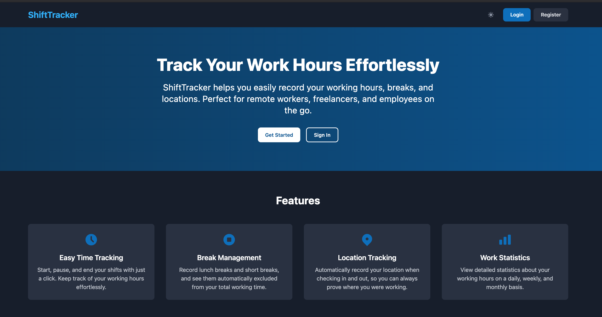
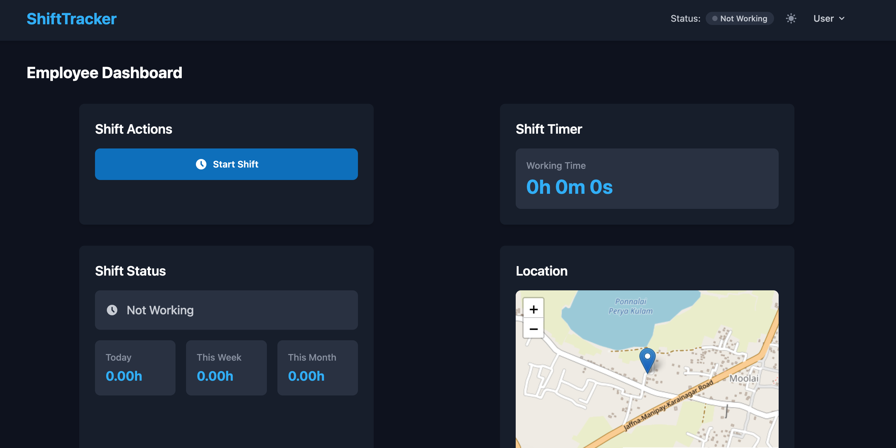
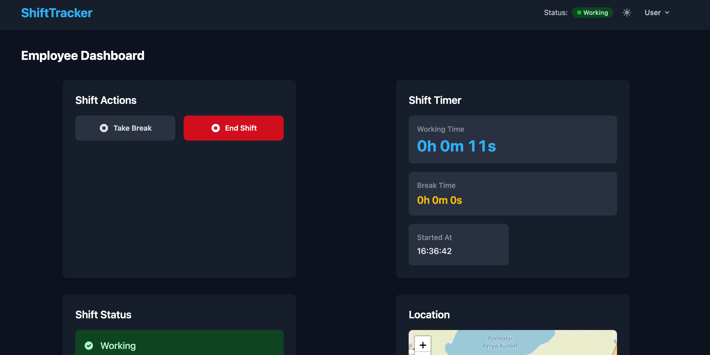
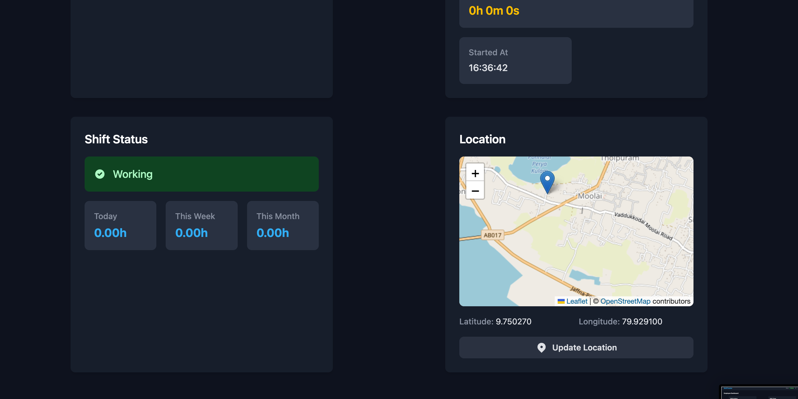

# ShiftTracker - Employee Time Tracking Web Application

A full-stack employee time tracking web application that enables employees to clock in/out of shifts, manage breaks, and track work hours with GPS-based location verification. Features role-based access with an Admin Dashboard for workforce oversight and a personal Employee Dashboard for individual shift management.

## Screenshots

### Landing Page


### Employee Dashboard - Inactive


### Employee Dashboard - Active Shift


### Shift Status & Location Tracking


## Features

- **Real-Time Shift Tracking** — Start and end work shifts with a single click, with a live timer displaying working hours in real time
- **Break Management** — Support for Lunch Break and Short Break types, with automatic exclusion of break time from total working hours
- **GPS Location Tracking** — Captures employee geolocation at shift start/end and break transitions, displayed on an interactive map
- **Work Statistics** — View daily, weekly, and monthly working hour summaries at a glance
- **Shift History** — Paginated history table showing date, start/end times, duration, and break count
- **Admin Dashboard** — View all employees, manage roles (Employee/Admin), toggle active/inactive status, and review all shift records
- **CSV Export** — Export shift data to CSV for payroll or reporting
- **JWT Authentication** — Secure token-based authentication with role-based route protection
- **Dark Mode** — System-aware dark/light theme toggle with localStorage persistence
- **Responsive Design** — Mobile-first UI that adapts across all screen sizes
- **Email Notifications** — Automated shift start/end confirmation emails

## Tech Stack

### Frontend
| Technology | Purpose |
|---|---|
| React 19 | UI framework |
| Vite | Build tool with HMR |
| Tailwind CSS 4 | Utility-first styling |
| React Router v7 | Client-side routing |
| Axios | HTTP client |
| Leaflet / React-Leaflet | Interactive maps |
| date-fns | Date formatting |
| jwt-decode | Token decoding |

### Backend
| Technology | Purpose |
|---|---|
| Node.js | Runtime |
| Express.js | Web framework |
| MongoDB | Database |
| Mongoose | ODM |
| JSON Web Token | Authentication |
| bcryptjs | Password hashing |
| Nodemailer | Email notifications |

## Project Structure

```
time-tracker-web-app/
├── time-tracker-webapp-backend/
│   ├── controllers/        # Route handlers (auth, shift, admin)
│   ├── models/             # Mongoose schemas (User, Shift)
│   ├── routes/             # API endpoint definitions
│   ├── middleware/          # Auth & error handling middleware
│   ├── utils/              # Email service
│   └── server.js           # Entry point
├── time-tracker-webapp-frontend/
│   ├── src/
│   │   ├── components/     # Reusable UI components
│   │   ├── context/        # React Context (Auth, Shift, Theme)
│   │   ├── pages/          # Page components
│   │   └── App.jsx         # Root component with routing
│   └── index.html
├── screenshots/
└── README.md
```

## Getting Started

### Prerequisites

- Node.js (v18+)
- MongoDB (running locally or a cloud URI)

### 1. Clone the repository

```bash
git clone https://github.com/your-username/time-tracker-web-app.git
cd time-tracker-web-app
```

### 2. Backend Setup

```bash
cd time-tracker-webapp-backend
npm install
cp .env.example .env
# Edit .env with your MongoDB URI, JWT secret, and email credentials
npm run dev
```

The backend runs on `http://localhost:3001` by default.

### 3. Frontend Setup

```bash
cd time-tracker-webapp-frontend
npm install
cp .env.example .env
# Edit .env if your backend runs on a different URL
npm run dev
```

The frontend runs on `http://localhost:5173` by default.

## API Endpoints

### Authentication
| Method | Endpoint | Description |
|---|---|---|
| POST | `/api/auth/register` | Admin setup only: emails in `ADMIN_EMAILS` register as admins; everyone else gets 403 |
| POST | `/api/auth/login` | Login |
| GET | `/api/auth/me` | Get current user profile |

### Shifts (Authenticated)
| Method | Endpoint | Description |
|---|---|---|
| GET | `/api/shifts/current` | Get active shift |
| POST | `/api/shifts/start` | Start a new shift |
| POST | `/api/shifts/end` | End current shift |
| POST | `/api/shifts/break/start` | Start a break |
| POST | `/api/shifts/break/end` | End current break |
| GET | `/api/shifts/history` | Get shift history (paginated) |
| GET | `/api/shifts/stats` | Get work hour statistics |

### Admin (Admin role required)
| Method | Endpoint | Description |
|---|---|---|
| GET | `/api/admin/employees` | List all employees |
| POST | `/api/admin/employees` | Create an employee account (`name`, `email`, `password`, `role`) |
| PUT | `/api/admin/employees/role` | Update employee role |
| PUT | `/api/admin/employees/status` | Activate/deactivate employee |
| PUT | `/api/admin/employees/password` | Reset an employee's password |
| PUT | `/api/admin/employees/email` | Change an employee's login email (not allowed for, or to, `ADMIN_EMAILS` addresses) |
| DELETE | `/api/admin/employees/:userId` | Delete an employee account. Their shifts are kept and labeled "(deleted)". Refused while they're clocked in |
| GET | `/api/admin/shifts` | List shifts; filter with `employeeId`, `from`, `to` (ISO); paginated with `page`, `limit` |
| GET | `/api/admin/shifts/export` | CSV of all matching shifts (same filters, plus `tz` for local times) |
| PUT | `/api/admin/shifts/:shiftId` | Correct or close a shift (`startTime`, `endTime`, required `note`) |

Admins can't demote or deactivate themselves, and accounts listed in `ADMIN_EMAILS` can't be demoted or deactivated by anyone.

## Shift Reports

During a shift, workers fill in a **Today's job** card: they pick the site (nearest suggested by GPS), take tagged photos (Before / During / After), tap the work done and any issues, and can add a short note. Everything autosaves. **End Shift** opens a wrap-up sheet that only asks for what's missing. Admins manage sites, tasks and issue flags under **Admin → Setup**, and review reports and photos from the Shifts tab. Photos are stored privately in Cloudflare R2 and shown through links that expire after an hour. See [the design spec](docs/superpowers/specs/2026-10-01-shift-reports-design.md).

## Team Setup

1. Set `ADMIN_EMAILS=you@company.com` (comma-separated for several) in the backend `.env`.
2. Open `/register` and create your account with that email. It becomes an admin.
3. In **Admin Dashboard → Employees**, add each team member with a temporary password and share it with them.
4. Use **Admin Dashboard → Shifts** to filter by person and date range, close forgotten shifts (a reason is recorded), and export CSVs for payroll.

## Environment Variables

### Backend (`time-tracker-webapp-backend/.env`)

See [`.env.example`](time-tracker-webapp-backend/.env.example) for the full list.

| Variable | Required | Purpose |
|---|---|---|
| `MONGODB_URI` | yes | MongoDB connection string (local or Atlas) |
| `JWT_SECRET` | yes | 32+ random characters. The server refuses to start without one |
| `ADMIN_EMAILS` | yes | Comma-separated emails that may use `/register` and are always admins |
| `NODE_ENV` | | `production` makes the backend serve the built frontend |
| `REQUIRE_LOCATION` | | `true` blocks clock-in/out without GPS. By default it's optional, and shifts without GPS are flagged "no GPS" for admins |
| `CORS_ORIGIN` | | Allowed origins when the frontend runs on a different domain |
| `TRUST_PROXY` | | Set to `1` behind a reverse proxy so login rate limiting sees real client IPs |
| `MAX_SHIFT_HOURS` / `MAX_EDIT_AGE_DAYS` | | Limits on admin corrections (default 24h / 90 days) |
| `EMAIL_USER` / `EMAIL_APP_PASSWORD` | | Gmail notifications. Leave blank to disable |
| `TZ` | | Time zone for times in notification emails |
| `R2_ACCOUNT_ID` / `R2_ACCESS_KEY_ID` / `R2_SECRET_ACCESS_KEY` / `R2_BUCKET` | for photos | Private Cloudflare R2 bucket for shift report photos |

### Frontend (`time-tracker-webapp-frontend/.env`)

Only needed in development: `VITE_API_URL=http://localhost:3001` (this is also the default). Don't set it for production builds. The production frontend calls its own origin.

## Running in Production

```bash
cd time-tracker-webapp-frontend && npm ci && npm run build
cd ../time-tracker-webapp-backend && npm ci
NODE_ENV=production npm start   # serves the app and API on PORT
```

### Deploying to Vercel

The repo is set up as a single Vercel project. `vercel.json` builds the frontend as static files, and [`api/index.js`](api/index.js) runs the Express API as a serverless function under `/api`.

1. Import the repo in Vercel and keep the root directory as the repo root. The build settings come from `vercel.json`.
2. Add these environment variables (Production): `MONGODB_URI`, `JWT_SECRET`, `ADMIN_EMAILS`, plus any optional ones above.
3. In MongoDB Atlas → **Network Access**, allow `0.0.0.0/0`. Vercel functions don't have fixed IPs.

Login rate limiting is per function instance on Vercel, so treat it as best-effort.

Serve it over **HTTPS**. Browsers only allow GPS on secure origins, so without HTTPS every shift will be "no GPS".

## License

This project is for portfolio/educational purposes.
